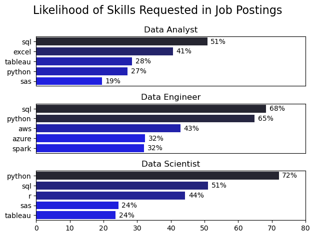

# 📊 Overview

👋 Welcome to My Data Job Market Analysis. This project offers a focused exploration of the data job landscape, with an emphasis on Data Analyst roles. It was born from a personal need to better understand the job market and identify high-impact opportunities within the field.

Using a dataset provided in [Luke Barousse’s Hugging Face Dataset](https://huggingface.co/datasets/lukebarousse/data_jobs) which provides rich details on job titles, salaries, locations, and required skills, I conducted a series of Python-driven analyses to answer key questions such as the most demanded skills, salary trends, and the intersection of demand and salary in data analytics.

The goal is to provide actionable insights for anyone pursuing or advancing a career in data analytics.

# ❓ Key Questions Explored
This project aims to answer the following questions:

- Which skills are most in demand for the top three most common data roles?
- What are the current trends in skill demand specifically for Data Analyst positions?
- How do salaries compare across different skills and job titles within data analytics?
- Which skills offer the best value for Data Analysts, those that are both High Demand AND High Paying?

# 🛠️ Tools & Technologies Used
For my deep dive into the data analyst job market, I harnessed the power of several key tools:

- Python: The backbone of my analysis, allowing me to analyze the data and find critical insights.I also used the following Python libraries:
    - Pandas Library: Used extensively for data cleaning, manipulation, and exploration.
    - Matplotlib Library: Helped generate basic plots for visualizing trends and distributions.
    - Seaborn Library: Enabled the creation of more advanced, aesthetically appealing visualizations.
- Jupyter Notebooks: The tool I used to run my Python scripts which let me easily include my notes and analysis.
- Visual Studio Code: My preferred code editor for writing and debugging Python scripts.
- Git & GitHub: Essential for version control and sharing my Python code and analysis, ensuring collaboration and project tracking.

# 🧹 Data Preparation & Cleaning
This section outlines the steps taken to prepare the data for analysis, ensuring accuracy and usability.

## Import & Clean Up Data
I start by importing necessary libraries and loading the dataset, followed by initial data cleaning tasks to ensure data quality.
```python
# Importing Libraries
import ast
import pandas as pd
import seaborn as sns
from datasets import load_dataset
import matplotlib.pyplot as plt  

# Loading Data
dataset = load_dataset('lukebarousse/data_jobs')
df = dataset['train'].to_pandas()

# Data Cleanup
df['job_posted_date'] = pd.to_datetime(df['job_posted_date'])
df['job_skills'] = df['job_skills'].apply(lambda x: ast.literal_eval(x) if pd.notna(x) else x)
```


# 📊 The Analysis
Each Jupyter notebook for this project aimed at investigating specific aspects of the data job market. Here’s how I approached each question:

## 1. What are the most demanded skills for the top 3 most popular data roles?

To identify the most in-demand skills for the top three data roles, I first filtered the dataset to find the most popular job titles. Then, I extracted the top five skills associated with each of these roles. This analysis reveals which skills are most relevant based on the specific data role I'm aiming for.

View my notebook with detailed steps here: [2_Skills_Count.ipynb](3_Project\2_Skills_Count.ipynb)

### Visualize Data
```python
fig, ax = plt.subplots(len(job_titles), 1)

for i, job_title in enumerate(job_titles):
    df_plot = df_skills_perc[df_skills_perc['job_title_short'] == job_title].head(5)
    sns.barplot(data=df_plot, x='skill_percent', y='job_skills', ax=ax[i], hue='skill_count', palette='dark:b_r')

    
plt.show()
```
### Results



*Bar graph visualizing the salary for the top 3 data roles and their top 5 skills associated with each.*

### Insights
- SQL stands out as the most requested skill for both Data Analysts and Data Scientists, appearing in over 50% of job postings for each role.

- For Data Engineers, Python takes the lead, showing up in 68% of listings, highlighting its importance in engineering workflows.

- Data Engineering roles tend to emphasize specialized technical stacks like AWS, Azure, and Spark, whereas Data Analysts and Data Scientists are more often expected to have experience with general-purpose tools like Excel and Tableau.

- Python remains a versatile and widely sought-after skill across all three roles, but it's especially critical for Data Scientists (72%) and Data Engineers (65%).


## 2. How are in-demand skills trending for Data Analysts?

To find how skills are trending in 2023 for Data Analysts, I filtered data analyst positions and grouped the skills by the month of the job postings. This got me the top 5 skills of data analysts by month, showing how popular skills were throughout 2023.

View my notebook with detailed steps here: [3_Skills_Trend.ipynb](3_Project\3_Skills_Trend.ipynb)
### Visualize Data

```python

df_plot = df_DA_US_percent.iloc[:, :5]
sns.lineplot(data=df_plot, dashes=False, palette='tab10')
 

from matplotlib.ticker import PercentFormatter
ax = plt.gca()
ax.yaxis.set_major_formatter(PercentFormatter(decimals=0))

plt.show()

```
### Results


*Graph visualising the trending top skills for Data Analysts in the US in 2023.*

### Insights
- SQL maintained its position as the most consistently in-demand skill throughout the year, despite a slight downward trend in demand over time.

- Excel saw a notable surge in demand beginning around September, eventually overtaking both Python and Tableau by year-end.

- Python and Tableau exhibited relatively stable demand with minor fluctuations, reinforcing their continued relevance as core tools for data analysts.

- Power BI, while trailing behind the other tools in overall demand, showed a modest upward trend toward the close of the year, indicating growing interest.
## 3. How well do jobs and skills pay for Data Analysts?
To identify the highest-paying roles and skills, I only got jobs in the United States and looked at their median salary. But first I looked at the salary distributions of common data jobs like Data Scientist, Data Engineer, and Data Analyst, to get an idea of which jobs are paid the most.

View my notebook with detailed steps here: [4_Salary_Analysis.ipynb](3_Project\4_Salary_Analysis.ipynb)

#### Visualize Data

```python
sns.boxplot(data=df_US_top6, x='salary_year_avg', y='job_title_short', order=job_order)

ticks_x = plt.FuncFormatter(lambda x, pos: f'${int(x/1000)}K')
plt.gca().xaxis.set_major_formatter(ticks_x)  
plt.show()
```
#### Results

*Box plot visualizating the salary distribution for the top 6 data job titles.*

#### Insights
- There's a significant variation in salary ranges across different job titles. Senior Data Scientist positions tend to have the highest salary potential, with up to $600K, indicating the high value placed on advanced data skills and experience in the industry.

- Senior Data Engineer and Senior Data Scientist roles show a considerable number of outliers on the higher end of the salary spectrum, suggesting that exceptional skills or circumstances can lead to high pay in these roles. In contrast, Data Analyst roles demonstrate more consistency in salary, with fewer outliers.

- The median salaries increase with the seniority and specialization of the roles. Senior roles (Senior Data Scientist, Senior Data Engineer) not only have higher median salaries but also larger differences in typical salaries, reflecting greater variance in compensation as responsibilities increase.


### Highest Paid & Most Demanded Skills for Data Analysts
Next, I narrowed my analysis and focused only on data analyst roles. I looked at the highest-paid skills and the most in-demand skills. I used two bar charts to showcase these.
#### Visualize Data

```python
fig, ax = plt.subplots(2, 1)

# Top 10 highest paying Data Analyst skills
sns.barplot(data=df_DA_top_pay, x='median', y=df_DA_top_pay.index, ax=ax[0], hue='median', palette='dark:b_r')

# Top 10 most in-demand Data Analyst skills

sns.barplot(data=df_DA_skills, x='median', y=df_DA_skills.index, ax=ax[1], hue='median', palette='light:b')

plt.show()
```
#### Results
Here's the breakdown of the highest-paid & most in-demand skills for data analysts in the US:

*Two separate bar graphs visualizing the highest paid skills and most in-demand skills for data analysts in the US.*

#### Insights:
- The top graph shows specialized technical skills like `dplyr`, `Bitbucket`, and `Gitlab` are associated with higher salaries, some reaching up to $200K, suggesting that advanced technical proficiency can increase earning potential.

- The bottom graph highlights that foundational skills like `Excel`, `PowerPoint`, and `SQL` are the most in-demand, even though they may not offer the highest salaries. This demonstrates the importance of these core skills for employability in data analysis roles.

- There's a clear distinction between the skills that are highest paid and those that are most in-demand. Data analysts aiming to maximize their career potential should consider developing a diverse skill set that includes both high-paying specialized skills and widely demanded foundational skills.

 ## 4. What are the most optimal skills to learn for Data Analysts?
To identify the most optimal skills to learn ( the ones that are the highest paid and highest in demand) I calculated the percent of skill demand and the median salary of these skills. To easily identify which are the most optimal skills to learn.

View my notebook with detailed steps here: [5_Optimal_Skills.ipynb](3_Project\5_Optimal_Skills.ipynb)
#### Visualize Data
```python
from adjustText import adjust_text
import matplotlib.pyplot as plt

plt.scatter(df_DA_skills_high_demand['skill_percent'], df_DA_skills_high_demand['median_salary'])
plt.show()
```
#### Results

*A scatter plot visualizing the most optimal skills (high paying & high demand) for data analysts in the US.*
#### Insights:
- The skill `Oracle` appears to have the highest median salary of nearly $97K, despite being less common in job postings. This suggests a high value placed on specialized database skills within the data analyst profession.

- More commonly required skills like `Excel` and `SQL` have a large presence in job listings but lower median salaries compared to specialized skills like `Python` and `Tableau`, which not only have higher salaries but are also moderately prevalent in job listings.

- Skills such as `Python`, `Tableau`, and `SQL` Server are towards the higher end of the salary spectrum while also being fairly common in job listings, indicating that proficiency in these tools can lead to good opportunities in data analytics.


#### Visualizing Different Techonologies
Let's visualize the different technologies as well in the graph. We'll add color labels based on the technology (e.g., {Programming: Python})

#### Visualize Data
```python
from matplotlib.ticker import PercentFormatter

# Create a scatter plot
scatter = sns.scatterplot(
    data=df_DA_skills_tech_high_demand,
    x='skill_percent',
    y='median_salary',
    hue='technology',  # Color by technology
    palette='bright',  # Use a bright palette for distinct colors
    legend='full'  # Ensure the legend is shown
)
plt.show()
```
#### Results

*A scatter plot visualizing the most optimal skills (high paying & high demand) for data analysts in the US with color labels for technology.*

#### Insights:
- The scatter plot shows that most of the `programming` skills (colored blue) tend to cluster at higher salary levels compared to other categories, indicating that programming expertise might offer greater salary benefits within the data analytics field.

- The database skills (colored orange), such as Oracle and SQL Server, are associated with some of the highest salaries among data analyst tools. This indicates a significant demand and valuation for data management and manipulation expertise in the industry.

- Analyst tools (colored green), including Tableau and Power BI, are prevalent in job postings and offer competitive salaries, showing that visualization and data analysis software are crucial for current data roles. This category not only has good salaries but is also versatile across different types of data tasks.

# 📚 What I Learned
This project not only gave me valuable insights into the Data Analyst job market, but also strengthened my technical capabilities in Python and data analysis. Key takeaways include:

- Advanced Python Proficiency: I honed my skills using libraries like Pandas for data manipulation and Seaborn/Matplotlib for creating meaningful visualizations, enabling me to carry out complex analysis more effectively.

- The Critical Role of Data Cleaning: I gained a deeper appreciation for the importance of data cleaning and preprocessing. Clean data is the foundation of reliable analysis and accurate insights.

- Strategic Career Insight: This analysis highlighted how crucial it is to align technical skills with market demand. Understanding the interplay between skill popularity, salary potential, and job availability can guide smarter, data-driven career decisions in tech.

Overall, this project served as both a practical application of my data skills and a strategic exploration of the analytics job landscape.
# 💡 Key Insights
This project revealed several important insights about the data job market for analysts:

- Skill Demand vs. Salary: There's a strong correlation between the demand for certain skills and the salaries they command. Specialized tools and programming languages such as Python and Oracle are often associated with higher compensation.

- Evolving Market Trends: The demand for specific skills is constantly shifting, reflecting the dynamic nature of the data analytics field. Staying current with these trends is essential for long-term career growth.

- Economic Value of Skills: Understanding which skills are both in-demand and well-compensated can guide data analysts in prioritizing learning to maximize their economic returns.
# 🚧 Challenges Faced
While rewarding, this project came with its share of challenges that pushed me to think critically and improve my approach:

- Data Inconsistencies: Dealing with missing, inconsistent, or messy data entries required meticulous data-cleaning techniques to preserve the reliability and accuracy of the analysis.

- Complex Visualizations: Crafting clear and insightful visualizations from complex datasets proved to be challenging, but essential for effectively communicating key takeaways.

- Balancing Breadth and Depth: Deciding how deeply to dive into each analysis while maintaining a broad overview of the data landscape required constant balancing to ensure comprehensive coverage without getting lost in details.

# 🧾 Conclusion
This exploration into the data analyst job market has been incredibly informative, highlighting the critical skills and trends that shape this evolving field. The insights I got enhance my understanding and provide actionable guidance for anyone looking to advance their career in data analytics.

As the data industry evolves, continuous analysis and upskilling will be crucial for staying relevant. This project serves as a solid starting point for further explorations and reinforces the importance of lifelong learning and adaptability in the ever-changing world of data analytics.


